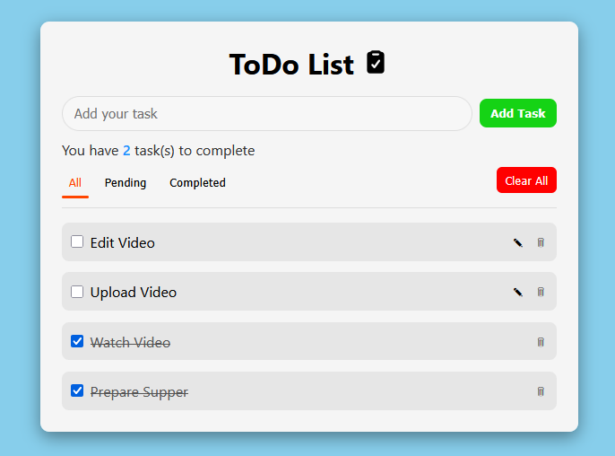
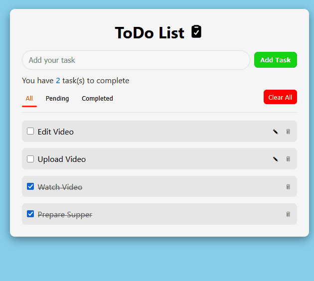
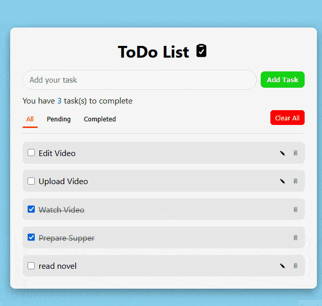
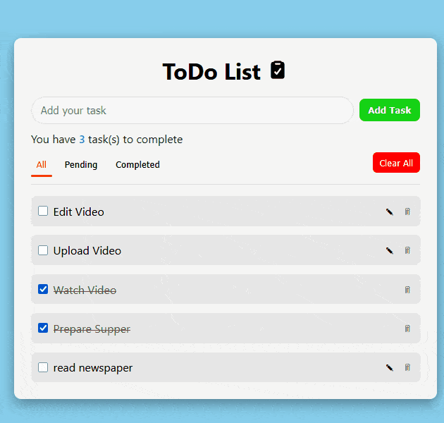
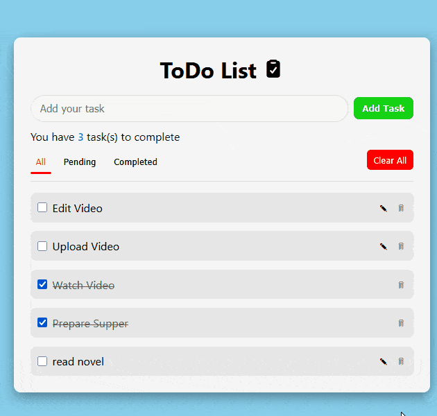

# 📝 Todo List App (Vanilla JavaScript)

A clean and interactive **Todo List application** built using **HTML, CSS, and Vanilla JavaScript**.  
The app focuses on maintainable state management, event delegation, and persistent storage using `localStorage`.

---

## 🚀 Preview

<p align="center">
  
</p>

---

## ✨ Features

### ➕ Add Tasks

Users can add new tasks using the input field or by pressing the **Enter** key.  
A short feedback message confirms when a task has been added successfully.

<p align="center">
  
</p>

```js
function addTodo(text) {
  const value = text.trim();
  if (!value) return false;

  state.todos.push({
    id: genId(),
    text: value,
    status: "pending",
  });

  saveState();
}
```

### ✅ Complete & Toggle Tasks

Tasks can be marked as completed or returned to pending using a checkbox.
Completed tasks are visually distinguished and excluded from editing.

<p align="center">
  
</p>

```js
function toggleTodo(id, completed) {
  const todo = state.todos.find((t) => t.id === id);
  if (!todo) return;

  todo.status = completed ? "completed" : "pending";
  saveState();
}
```

### ✏️ Edit Tasks Inline

Pending tasks can be edited inline.
Users can save changes with **Enter** button, **Clicking "Done"** and or cancel using **Escape**

<p align="center">
  
</p>

```js
function editTodo(id, newText) {
  const trimmed = newText.trim();
  if (!trimmed) return false;

  const todo = state.todos.find((t) => t.id === id);
  if (!todo) return false;

  todo.text = trimmed;
  saveState();
  return true;
}
```

### 🗑️ Delete Tasks

Each task includes a delete option with a confirmation prompt to prevent accidental removal.

<p align="center">
  
</p>

```js
function removeTodo(id) {
  state.todos = state.todos.filter((todo) => todo.id !== id);
  saveState();
}
```

### 🔍 Filter Tasks

Tasks can be filtered by: **All**, **Pending** and **Completed**
Filtering affects both the visible list and available actions

<p align="center">
  
</p>

```js
function filteredTodos() {
  if (state.filter === "all") return state.todos;
  return state.todos.filter((todo) => todo.status === state.filter);
}
```

### 🧹 Clear Tasks by Status

The **Clear** button adapts based on the active filter:

- Clears all tasks
- Clears pending tasks
- Clears completed tasks

<p align="center">
  
</p>

```js
function clearCompleted() {
  state.todos = state.todos.filter((t) => t.status !== "completed");
  saveState();
}
```

---

## 🏗 How It Works — Architecture & State Management

This Todo app follows a **single-source-of-truth / MVC-inspired pattern**:

- **Model (State):**
  - The `state` object holds the entire application data, including tasks and the current filter.
  - Example:
    ```js
    const state = {
      todos: [
        { id: "abc123", text: "Buy milk", status: "pending" },
        { id: "def456", text: "Call mom", status: "completed" },
      ],
      filter: "all",
    };
    ```

- **View (Rendering):**
  - The `render()` function generates the DOM based on the current `state`.
  - Whenever the `state` changes, `render()` is called to update the UI.
  - This ensures the UI always matches the underlying data.
    ```js
    function render() {
      dom.todoList.innerHTML = filteredTodos().map(itemHtml).join("");
      dom.tasksNum.textContent = countPending();
      highlightSelectedFilter();
    }
    ```

- **Controller (Actions / Event Handlers):**
  - All user interactions (add, edit, toggle, delete, filter) trigger **state-modifying functions** like `addTodo()`, `toggleTodo()`, or `editTodo()`.
  - Event delegation is used on the task list to manage dynamic elements efficiently.
    ```js
    dom.todoList.addEventListener("click", handleTodoAction);
    ```

- **Persistence:**
  - Any change to the state is **saved to `localStorage`**, and loaded on page refresh.
    ```js
    function saveState() {
      localStorage.setItem(STORAGE_KEY, JSON.stringify(state));
    }
    ```

**Flow in practice:**

1. User adds, edits, or toggles a task →
2. Corresponding function updates the `state` →
3. `render()` re-renders the UI →
4. `localStorage` is updated →
5. UI and storage are always in sync

This approach ensures:

- Decoupled logic from DOM manipulation
- No inconsistent UI states
- Easy addition of new features without breaking existing functionality

---

## 🛠️ Tech Stack

- **HTML5** - Semantic markup
- **CSS3** - responsive layout
- **Vanilla JavaScript (ES6+)**:
  - Event delegation
  - Single-source-of-truth pattern
  - LocalStorage Persistence
  - Modular rendering logic

---

## 📁 Project Structure

```
todo-app/
│
├── index.html
├── css/
│ └── style.css
├── scripts/
│ └── app.js
├── assets/
│ ├── images/
│
└── README.md
```

---

## ⚙️ Getting Started

1. Clone the repository

```bash
git clone https://github.com/Lewis-mbui/todo-list-vanilla-js
```

2. Open `index.html` in your browser (No dependencies or build tools required)

---

## 👤 Author

Github - [Lewis](https://github.com/Lewis-mbui)
